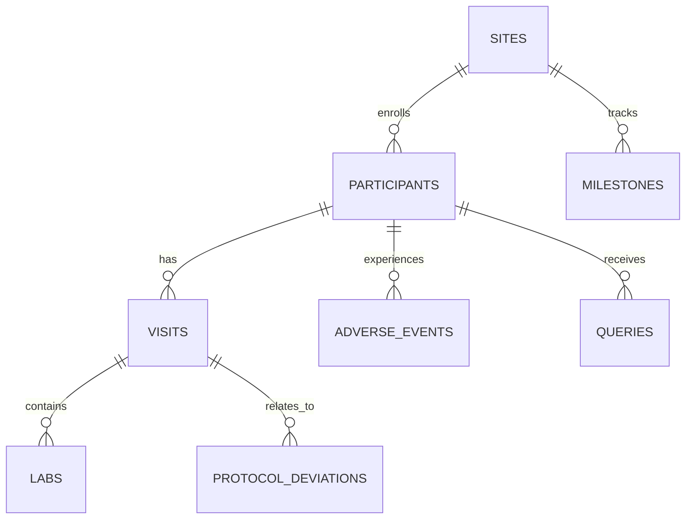

# Relational Data Design

## Entity Overview

## Keys

| Table | Primary key | Main foreign keys |
|---|---|---|
| `sites` | `site_id` | none |
| `participants` | `participant_id` | `site_id` |
| `visits` | `visit_id` | `participant_id`, `site_id` |
| `labs` | `lab_id` | `participant_id`, `site_id`, `visit_id` |
| `adverse_events` | `ae_id` | `participant_id`, `site_id` |
| `queries` | `query_id` | `participant_id`, `site_id`, `record_id` |
| `protocol_deviations` | `deviation_id` | `participant_id`, `site_id`, `related_visit_id` |
| `milestones` | `milestone_id` | `site_id` |

## Relational Practice Demonstrated

- joining participant and site tables to produce enrollment metrics
- joining visits and participants for status-aware adherence checks
- joining labs to visits for assessment completeness
- grouping queries by site and status
- calculating open query ageing
- aggregating AEs by site, seriousness, and severity
- summarising validation issues by check and severity
- building dashboard-ready outputs from linked tables